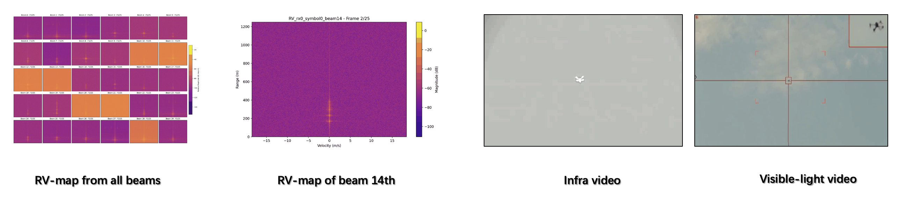
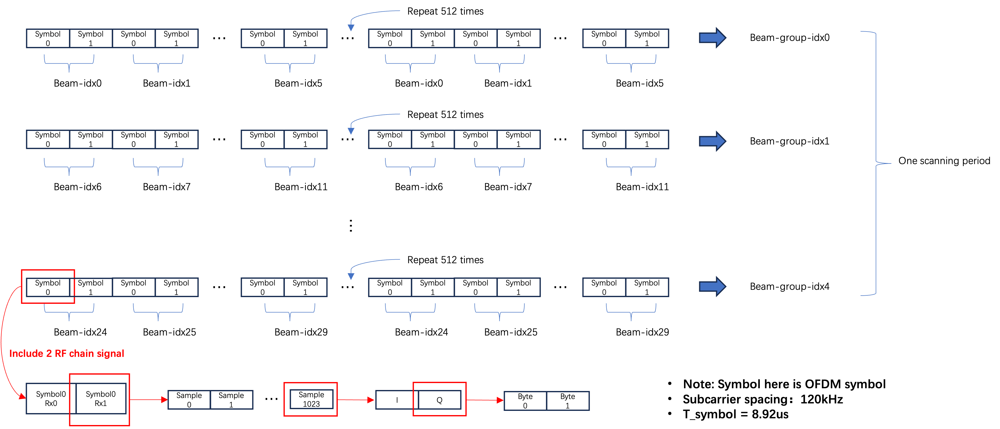
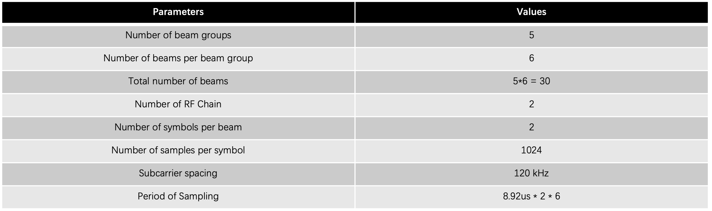

# CellularEye Dataset  
**This is a blind-review version of the project, and the scripts in this repository are still being actively updated.**

> A Large-Scale, Evolving Multimodal Dataset for Environmental Perception Based on Commercial off-the-shelf (COTS) 5G/5G-A gNB Devices

## Introduction

**CellularEye** is a pioneering large-scale multimodal dataset designed for cutting-edge environmental perception research. Its core feature is the use of **commercial communication equipment (BBU, AAU)** to collect real-world cellular network IQ data, synchronized with high-resolution visible-light video, infrared video, and weather data. Our goal is to bridge the gap between communication and sensing, providing robust, real-world data support for researchers exploring the future of **Integrated Sensing and Communication (ISAC)**. 




## Key Features

- **Commercial Cellular Signals**: Data originates from operational, commercial cellular network equipment.
- **Rich Multimodal Data**: Includes tightly synchronized IQ data streams, RGB video, infrared video, and detailed meteorological metrics.
- **Diverse Scenarios**: Covers a wide range of real-world scenarios, including different times of day, weather conditions, and target activities.

## Dataset Structure

```text
<dataset_root>/
└── 2025_09_27_00_00/
    ├── camera/
    ├── meteorological/
    └── mmw/
        ├── 21/
        │   ├── 2025_09_27_00_01_01_280.bin
        │   └── ...
        ├── 22/
        ├── 23/
        └── 24/
```

#### mmWave IQ Data Illustration

Each `.bin` file represents one sensing frame. The data arrangement within the `.bin` file is shown in the figure below.



#### System Parameters Illustration

The system's sensing parameters are shown in the figure below.




## Quick Start & Provided Scripts

### Create and activate the environment**:
   ```bash
   # Create the environment from the provided config file
   mamba env create -f environment.yaml
   mamba activate cellulareye
   ```

To facilitate easy usage and reproduction of our dataset analysis, we provide the following python scripts in the `src/` directory.

### Dataset Processing & Generation
- **`src/generate_real_dataset.py`**: Processes raw `.bin` recordings, applies phase correction/calibration, and generates YOLO bounding box labels for real-world captures.
- **`src/generate_simulate_dataset.py`**: Focuses on generating simulated data without complex real-world alignment issues, serving as a baseline.
- **`src/generate_synthetic_dataset.py`**: Generates fully synthetic Range-Doppler (RD) maps and YOLO labels using mathematical target models.

### Visualization & Verification
- **`src/visualize_dataset.py --type real`**: Generates GIFs and visual grids to verify the alignment between target bounding boxes and real radar IQ RD images.
- **`src/visualize_dataset.py --type synthetic`**: Visual confirmation tool for synthetic data.

### Academic Reproducibility
- **`src/save_rd_paper_fig.py`**: Specialized tool for generating high-quality, publication-ready RD figures used in our paper. Includes support for 30-beam unified grids and customizable academic matplotlib presets.

**Example Command**:
```bash
python src/save_rd_paper_fig.py --bin_dir /path/to/data/2025_10_18_00_00/mmw --bs_id 23 --beam_id 30
```
- **`Exp_Redo_D_E/code/train_errorbar.py`** Train cross-domain adaptation experiment with different data augmentation method (Empty BG, Real+Sim)

- **`Exp_Redo_D_E/code/test_and_vis_errorbar_bg.py`** Test and plot figure of cross-domain adaptation result with different data augmentation method (Empty BG, Real+Sim)

> **Download Data**: We recommend downloading the dataset via the following links. To ensure the reproducibility of your research, please explicitly state the dataset version you used in your paper.

| Version | Release Date | Description | Download Link |
| :--- | :--- | :--- | :--- |
| **v1.0** | October 2025 | First public release. Includes IQ, infrared, visible-light from different times of the day. | [Huggingface CellularEye](https://huggingface.co/datasets/anonymousff/CellularEye_v1.0) |
| **v1.1** | December 2025 | Add: meteorological data and drone target data. | [Huggingface CellularEye](https://huggingface.co/datasets/anonymousff/CellularEye_v1.0) |

## License and Citation

* **Code License:** The source code in this repository is licensed under the [MIT License](LICENSE).
* **Patent Notice:** The underlying algorithms and data processing methods may be subject to pending or granted patents owned by the relevant rights holders. The MIT license granted herein applies strictly to the source code and does not convey any express or implied licenses under such patents. For commercial use of the patented methods, please contact the appropriate rights holder or technology transfer office.
* **Dataset License:** The CellularEye dataset is hosted separately on [HuggingFace](https://huggingface.co/datasets/anonymousff/CellularEye_v1.0) and is strictly licensed under the **CC BY-NC 4.0** (Creative Commons Attribution-NonCommercial 4.0 International) license. It is intended for academic research only.