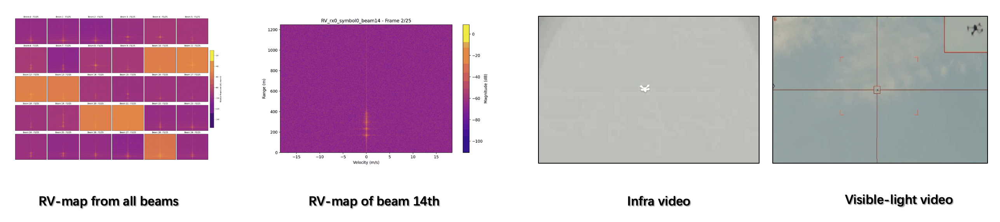
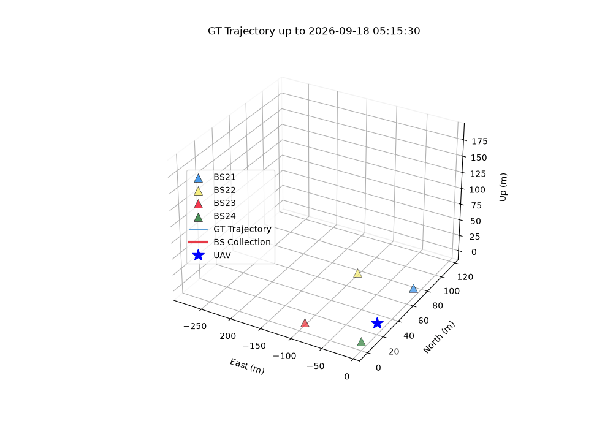
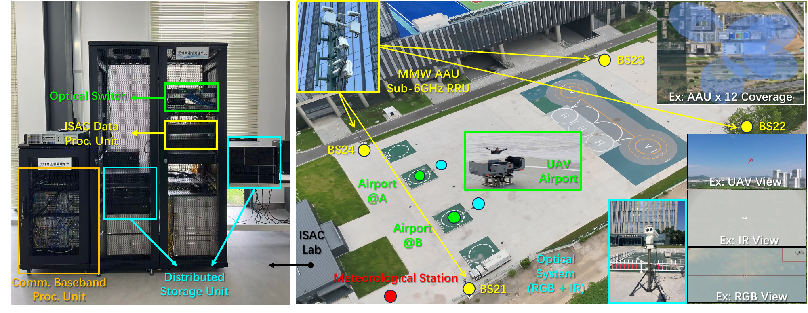

<div align="center">

# CellularEye

### ISAC in Practice: The CellularEye Dataset

Real-world cellular sensing data for noncooperative UAV research

[](#quick-start)
[](http://pmldatanet.com.cn/dataapp/multimodal)
[](#downloads)

[PML Data Portal](http://pmldatanet.com.cn/dataapp/multimodal) · [ScienceDB](https://doi.org/10.57760/sciencedb.018bv) · [Gallery](#visual-gallery) · [Testbed](#testbed) · [Parameters](#mmwave-signal-and-radar-parameters) · [Benchmark](#benchmark) · [Quick Start](#quick-start) · [Issues](https://github.com/ffxu1024/CellularEye/issues)

</div>

<p align="center">
  
</p>

**CellularEye** is a real-world dataset acquired using OFDM reference signals on experimental base stations for noncooperative UAV sensing. It combines complex-valued channel measurements with UAV flight records, RGB/infrared video, and weather observations across receiving sites, beams, trajectories, acquisition periods, and sunny/rainy conditions.

This repository focuses on **reading measurements, visualizing range–Doppler (RD) maps and flight trajectories, and constructing annotated real-data detection datasets**.

> **Data availability.** ScienceDB Version 1 is under review; its assigned DOI and CSTR are not yet registered. Prepared benchmark downloads are not yet published.

## At a Glance

| Resource | Contents |
| :--- | :--- |
| Channel measurements | 25.6 GHz mmWave measurements; 30 scanned beams; two receive channels and two OFDM symbols per beam visit |
| Associated records | UAV positions and motion, RGB/IR video, and meteorological observations; availability varies by collection |
| Collection scenarios | Multiple flight geometries and Go/Back segments, receiving stations, beams, periods, and weather conditions |
| Prepared benchmark | Download package pending publication |
| Toolkit | Binary reading, RD visualization, flight/collection-window visualization, and position-assisted annotation |

The acquisition platform and each downloadable release may cover different resources. Consult the selected release's file list for its actual contents.

## Visual Gallery

These are **measured UAV-present collections**, displayed over the full range and velocity axes. Every RD GIF contains all **52 recorded frames** for its receiver/beam, without temporal subsampling or RD cropping. Visible target returns vary across frames. The boxes are position-assisted, echo-refined annotations, not model predictions.

### Same collection, two receiving stations

**Sunny · Traj-1-1 Back · collection `2026_09_05_05_30` · Beam14 · Rx channel 0 · OFDM symbol 0**

| BS23 / Beam14 | BS22 / Beam14 |
| :---: | :---: |
|  |  |

Both receivers observed the same acquisition period. The BS22 sequence illustrates the structured interference present at that receiving site. Open the [BS23 GIF](assets/gifs/sunny_bs23_beam14_rd.gif) or [BS22 GIF](assets/gifs/sunny_bs22_beam14_rd.gif) for full-resolution viewing.

### Rainy UAV sensing

**Rainy · Traj-1 Back · collection `2026_09_17_22_54` · BS23 / Beam14 · Rx channel 0 · OFDM symbol 0**

<p align="center">
  
</p>

[Open the complete rainy RD GIF](assets/gifs/rainy_bs23_beam14_rd.gif).

### Flight trajectory and RF collection window

These previously generated `check_bin` animations show the timestamped UAV flight, base-station positions, and the segment overlapping RF acquisition. The colored **BS Collection** segment marks the collection window within the longer flight; the moving UAV marker shows progression along the recorded trajectory.

| Sunny · Traj-1-1 Back · 97 flight samples | Rainy · Traj-1 Back · 98 flight samples |
| :---: | :---: |
|  |  |

These animations use accelerated playback. Read the acquisition timestamps rather than interpreting GIF playback duration as measurement duration. The RD sequences and trajectory animations have different sampling rates. Source collection identifiers, frame counts, and checksums are provided in [the gallery manifest](docs/gallery_manifest.json). GIF files retain their original resolution and can take time to load.

## Testbed

CellularEye is collected on a **228 m × 70 m outdoor testbed** at Purple Mountain Laboratories. Four base-station sites (BS21–BS24), RGB/IR optics, a weather station, and automated UAV facilities provide associated RF, visual, environmental, and flight records.

<p align="center">
  
</p>

<p align="center"><em>Testbed layout and acquisition equipment at Purple Mountain Laboratories.</em></p>

BS23 provides mmWave illumination, with separate transmit and receive AAUs supporting simultaneous illumination and echo acquisition. The current archived mmWave measurements are organized under receiving sites BS22 and BS23; the four-site deployment shown above describes the platform. Available records vary by collection. Sub-6 GHz measurements are reserved for a subsequent release.

## mmWave Signal and Radar Parameters

### Signal and acquisition settings

| Parameter | Value | Description |
| :--- | :--- | :--- |
| Carrier frequency | 25.6 GHz | Released mmWave measurement configuration |
| Waveform | OFDM reference signal | CSI is obtained using a Zadoff–Chu reference sequence |
| Subcarrier spacing | 120 kHz | NR numerology μ = 3 |
| Subcarriers / complex samples per symbol and channel | 1,024 | Frequency / range dimension |
| Effective sensing bandwidth | 122.88 MHz | 1,024 × 120 kHz |
| Useful OFDM symbol duration | 8.3333 μs | Excludes cyclic prefix |
| CP-inclusive OFDM symbol duration | Approximately 8.92 μs | Manufacturer-provided timing used for processing |
| Beam directions | 30 | Five groups of six beams; zero-based beam IDs 0–29 |
| OFDM symbols per beam visit | 2 | Symbol IDs 0–1 |
| Receive channels | 2 | Channel IDs 0–1 |
| Slow-time observations per beam and symbol | 512 | Repeated visits within one beam group |
| Nominal sweep interval | 400 ms | Use individual file timestamps for temporal alignment |
| Stored complex sample | Interleaved I/Q; signed 16-bit big-endian per component | 4 bytes per complex sample |
| Complete 30-beam sweep | 251,658,240 bytes (240 MiB) | One complete `.bin` file |

<details>
<summary><strong>AAU hardware specifications</strong></summary>

| Parameter | Specification |
| :--- | :--- |
| Operating band | 26 GHz band |
| Configurable hardware bandwidth | 100–200 MHz |
| EIRP | 48 dBm |
| Planar array | 4 × 4 |
| Polarization channels | Horizontal and vertical |
| Upward-facing panel tilt | Nominally 45° |

The configurable hardware bandwidth is a device capability; the effective sensing bandwidth of the released configuration above is 122.88 MHz.

</details>

### Derived RD coordinates and theoretical limits

| Parameter | Value | Relation / interpretation |
| :--- | :--- | :--- |
| Same-beam / same-symbol PRI | 107.04 μs | 6 beams × 2 symbols × 8.92 μs |
| Per-beam CPI | 54.80448 ms | 512 × PRI |
| Range-bin spacing / theoretical resolution | 1.2207 m | c / (2 × bandwidth) |
| Radial-velocity-bin spacing / theoretical resolution | 0.1069 m/s | c / (2 × carrier frequency × CPI) |
| Theoretical unambiguous range | 1,250 m | c / (2 × subcarrier spacing) |
| Centered unambiguous velocity interval | Approximately [−27.37, +27.37) m/s | Limits ±c / (4 × carrier frequency × PRI) |
| RD matrix | 1,024 range bins × 512 velocity bins | Before image resizing or cropping |
| Range coordinate | n × 1.2207 m | n = 0, …, 1,023; use unrounded bin spacing in code |
| Velocity coordinate | (m − 256) × 0.1069 m/s | m = 0, …, 511; use unrounded bin spacing in code |

These values use c = 3 × 10⁸ m/s and the nominal timing above. PRI is the revisit interval for a fixed beam and symbol position; it is different from the 400 ms sweep interval. Theoretical unambiguous range is not an experimentally established detection range. Coordinates use the toolkit's half-path convention: with separate transmitter and receiver sites, range is half the total Tx–target–Rx path and velocity is its time derivative.

## Downloads

| Resource | Location | Availability |
| :--- | :--- | :--- |
| Dataset homepage | [PML multimodal data portal](http://pmldatanet.com.cn/dataapp/multimodal) | Dataset information and access instructions |
| Archival dataset, Version 1 | [ScienceDB DOI](https://doi.org/10.57760/sciencedb.018bv) · [CSTR](https://cstr.cn/31253.11.sciencedb.018bv) | **Under review; identifiers not yet registered** |
| Prepared real-data benchmark | [GitHub Releases](https://github.com/ffxu1024/CellularEye/releases) | **Archive pending publication** |

For detection experiments, use the prepared benchmark when available. To inspect channel measurements or construct your own dataset, download the required raw collections through the dataset portal. Raw recordings and processed benchmark images are separate downloads.

### Raw collection structure

```text
<dataset_root>/
└── 2025_12_09_12_00/
    ├── mmw/
    │   ├── 22/
    │   │   └── *.bin
    │   └── 23/
    │       └── *.bin
    ├── camera/           # RGB / infrared video
    ├── meteorological/  # Weather observations
    └── uav/             # Timestamped UAV flight records
```

The directories present depend on the collection. A collection identifier groups associated records; individual files retain their own timestamps.

### Binary measurements

<p align="center">
  
</p>

<p align="center"><em>Storage hierarchy of one complete .bin sweep, from beam groups to individual I/Q bytes. Indices are zero-based.</em></p>

One complete `.bin` file contains a 30-beam sweep: five groups of six beams, 512 repeated scans per group, two OFDM symbols per beam visit, two receive channels, and 1,024 complex samples per symbol/channel. I and Q are interleaved signed 16-bit big-endian integers. The complete sweep occupies 251,658,240 bytes (240 MiB).

The stored samples are a range-domain representation of CSI after acquisition-side FFT processing. The reader transforms the selected samples into a frequency–slow-time channel matrix; RD processing provides range and radial-velocity coordinates. Beam indices are `0–29`; symbol and receive-channel indices are `0–1`.

## Quick Start

Choose the workflow that matches your task:

| I want to… | Start here |
| :--- | :--- |
| Use prepared detection images and labels | [Benchmark](#benchmark) |
| Render an RD figure from a raw collection | [RD visualization](#rd-visualization) |
| Inspect flight trajectories and collection windows | [Trajectory and collection-window visualization](#trajectory-and-collection-window-visualization) |
| Generate a dataset from my selected real collections | [Real-data generation](#real-data-generation) |

### Installation

```bash
git clone https://github.com/ffxu1024/CellularEye.git
cd CellularEye
conda create -n cellulareye python=3.11
conda activate cellulareye
python -m pip install -r requirements-tested.txt
python -m pip install -e .
```

`requirements-tested.txt` records the dependency versions tested in a clean Python 3.11 environment. The editable installation installs this toolkit from `pyproject.toml`. The toolkit requires Python 3.11 or newer. No GPU is required for these tools.

### RD visualization

The existing public figure script accepts a raw collection's `mmw` directory:

```bash
python src/save_rd_paper_fig.py \
  --bin_dir /path/to/2025_12_09_12_00/mmw \
  --bs_id 23 \
  --beam_id 14 \
  --rx_id 0 \
  --symbol_id 0 \
  --frame_id 0 \
  --output_dir results/rd
```

Select `--beam_id 30` in this figure script to render all 30 beams. This value is a visualization option, not a valid beam index for the binary reader. Frames are selected by their zero-based position in the sorted file list.

See the [visual gallery](#visual-gallery) for complete measured RD sequences and flight/collection-window animations.

### Trajectory and collection-window visualization

The `check_bin.py` workflow renders RD sequences and a 3D UAV trajectory with the RF collection segment highlighted. Collections without UAV records can still be used for RD animation.

From the repository root, run:

```bash
python scripts/check_bin.py \
  --collection_path /path/to/2025_12_09_12_00 \
  --modality mmw \
  --bs_id 23 \
  --beam_id 14 \
  --rx_id 0 \
  --symbol_id 0 \
  --trajectory_animation \
  --max_frames 20
```

The existing workflow writes plots and RD GIFs under `results/plots/`. Use `--trajectory_animation` to save the UAV trajectory GIF and `--max_frames` to limit the preview. Omit the latter to process all frames; this can require substantial memory for long collections. Change the destination with `--output_dir`.

### Real-data generation

The real-data generator uses the position-assisted annotation workflow: associate UAV records with radio timestamps, compute geometric references, refine centers using local echoes, and export RD images and YOLO labels.

Generate a preview with:

```bash
python scripts/generate_real_dataset.py \
  --input_dir /path/to/collection_parent \
  --output_dir datasets/real_uav \
  --bs_id 23 \
  --beam_id 14 \
  --rx_id 0 \
  --symbol_id 0 \
  --width_bin 30 \
  --height_bin 30 \
  --split train \
  --max_frames 20
```

`--input_dir` contains collection directories. All selected collections are exported to `--split` (`train`, `val`, or `test`), without splitting adjacent frames automatically. Use separate collection groups for training, validation, and testing. The output directory gains a `_bs23_beam14_w30h30`-style suffix and contains `dataset.yaml` plus `generation.json` with the invocation, settings, sample origins, and counts. Transmitter BS23 is the default; change it explicitly with `--tx_bs_id` when appropriate. For multi-UAV records, select `--target_id`. Box dimensions are measured in RD bins. Position-assisted boxes are derived detection annotations; their dimensions are configurable.

RF timestamps in the current release use TAI and RTK records use UTC; their alignment uses a 37-second subtraction. The reader retains the existing zero-offset exception for January–May 2026 legacy files; use actual timestamp provenance when handling those older captures. Station geometry and transmitter/receiver roles must also match the selected collection.

For the fixed benchmark, use the released images, labels, and split manifests. Running a configurable generator on arbitrary collections does not reproduce the benchmark automatically.

### Preview generated labels

```bash
python src/visualize_real_dataset.py \
  --input_dir datasets/real_uav_bs23_beam14_w30h30 \
  --output_dir results/labels
```

This saves an image grid and an annotated GIF. Images are paired with labels by split and filename, including datasets with fewer than eight images.

## Benchmark

Prepared benchmark archives are not yet published. Available downloads will be listed on [GitHub Releases](https://github.com/ffxu1024/CellularEye/releases). In the meantime, use the raw-data portal and the real-data generation workflow above to build your own datasets.

## Usage Terms

The source code retains the repository's existing [MIT License](LICENSE).

**Patent Notice:** The underlying algorithms and data processing methods may be subject to pending or granted patents owned by the relevant rights holders. The MIT license granted herein applies strictly to the source code and does not convey any express or implied licenses under such patents. For commercial use of the patented methods, please contact the appropriate rights holder or technology transfer office.

The legacy Hugging Face dataset was distributed under CC BY-NC 4.0 for academic research. For each dataset download, follow the usage terms stated on its distribution page; the code license does not replace dataset terms.

## Support

For toolkit questions, please [open an issue](https://github.com/ffxu1024/CellularEye/issues) with the toolkit version, command, collection identifier, and relevant error output. For dataset access, consult the [PML data portal](http://pmldatanet.com.cn/dataapp/multimodal).
